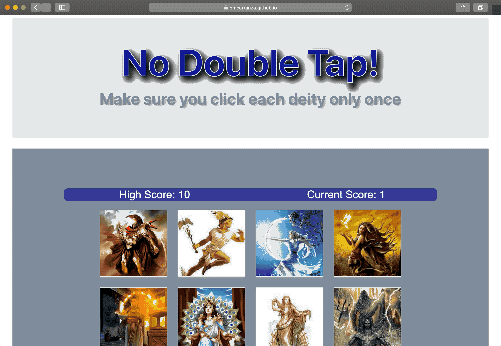

# **Memory Game**

## **Description**
The purpose of the game is keep track of the images clicked, when the user clicks on an image twice  the game restarts.
The app keeps track of the current score, every time the user clicks an image the score increases by 1.
The current high score is displayed at all times.
Follow the link below to give it a try.
https://pmcarranza.github.io/memory-game/

## **Technologies used**
•  HTML 
•  React
•  Bootstrap
•  JSX
•  CSS
•  GitHub pages.

### **Roadmap**
Before "branching out", I would like to display only 10 or 12 of the available 14 images and I think I the images displayed need to be a little bit smaller so it is a little more pleasent to the eye.
I think this app could be beneficial to children under 5 years old especially, to help them reinforce their knowledge of everyday things the goddesses/gods images could be replaced with fruits, animals, vehicles to make it more attractive to them.

### **Visual**
Quick example of how the app works

### **Maintenance**
I am the only one keeping up with this app if you would like to contribute to it feel free to clone/fork the repository and I would appreciate your input or feedback.

### **Support**
Feel free to email me at marino.carranza@gmail.com with question about this project.

### **Acknowledgements**
I would like to thanks Catherine Pham and Ben Vaagen for their guidance and assistance.

## **General Info**

This project was bootstrapped with [Create React App](https://github.com/facebook/create-react-app).

## Available Scripts

In the project directory, you can run:

### `npm start`

Runs the app in the development mode. 
Open [http://localhost:3000](http://localhost:3000) to view it in the browser.

The page will reload if you make edits. 
You will also see any lint errors in the console.

### `npm test`

Launches the test runner in the interactive watch mode. 
See the section about [running tests](https://facebook.github.io/create-react-app/docs/running-tests) for more information.

### `npm run build`

Builds the app for production to the `build` folder. 
It correctly bundles React in production mode and optimizes the build for the best performance.

The build is minified and the filenames include the hashes. 
Your app is ready to be deployed!

See the section about [deployment](https://facebook.github.io/create-react-app/docs/deployment) for more information.

### `npm run eject`

**Note: this is a one-way operation. Once you `eject`, you can’t go back!**

If you aren’t satisfied with the build tool and configuration choices, you can `eject` at any time. This command will remove the single build dependency from your project.

Instead, it will copy all the configuration files and the transitive dependencies (Webpack, Babel, ESLint, etc) right into your project so you have full control over them. All of the commands except `eject` will still work, but they will point to the copied scripts so you can tweak them. At this point you’re on your own.

You don’t have to ever use `eject`. The curated feature set is suitable for small and middle deployments, and you shouldn’t feel obligated to use this feature. However we understand that this tool wouldn’t be useful if you couldn’t customize it when you are ready for it.

## Learn More

You can learn more in the [Create React App documentation](https://facebook.github.io/create-react-app/docs/getting-started).

To learn React, check out the [React documentation](https://reactjs.org/).

### Code Splitting

This section has moved here: https://facebook.github.io/create-react-app/docs/code-splitting

### Analyzing the Bundle Size

This section has moved here: https://facebook.github.io/create-react-app/docs/analyzing-the-bundle-size

### Making a Progressive Web App

This section has moved here: https://facebook.github.io/create-react-app/docs/making-a-progressive-web-app

### Advanced Configuration

This section has moved here: https://facebook.github.io/create-react-app/docs/advanced-configuration

### Deployment

This section has moved here: https://facebook.github.io/create-react-app/docs/deployment

### `npm run build` fails to minify

This section has moved here: https://facebook.github.io/create-react-app/docs/troubleshooting#npm-run-build-fails-to-minify
